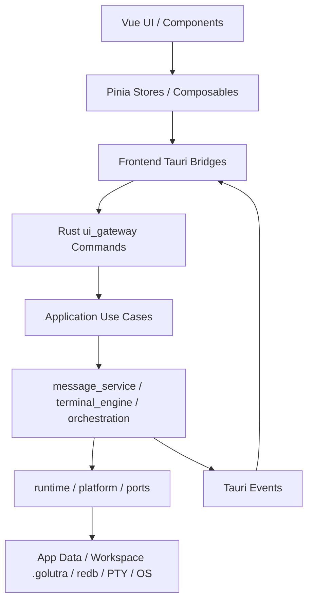

# 当前架构分析

## 总体结构

前端用功能目录组织，但大量业务流程在 Pinia store 和 Vue SFC 内完成。后端比前端更接近分层：`ui_gateway` 暴露命令，`application` 调用领域服务，`message_service` 与 `terminal_engine` 执行业务，`runtime/platform` 封装系统能力。不过 `ui_gateway/app.rs` 和 `terminal_engine/session/mod.rs` 仍然很重。

## 前端架构

### 应用启动

`src/main.ts` 负责：

- 创建 Pinia。
- 提前 hydrate 全局设置。
- 初始化监控。
- 注入 i18n。
- 挂载 `App.vue`。

`App.vue` 负责：

- 判断当前窗口视图：主窗口、终端窗口、工作区选择窗口、通知预览窗口。
- 处理无边框窗口标题栏、拖动、最大化、最小化、关闭、resize handle。
- 监听主题/语言变化事件。
- 注册上下文菜单和快捷键。
- 在工作区缺失时进入工作区选择视图。

### 状态管理

主要 store：

- `settingsStore`：账户、通知、快捷键、聊天、主题、成员终端路径、默认终端、自定义 CLI。
- `workspaceStore`：当前工作区、最近工作区、只读/警告、注册表冲突提示。
- `projectStore`：工作区成员、路线图、项目技能、最近关闭终端 tab。
- `chatStore`：会话、消息、未读、分页、消息状态、终端流式输出回写。
- `terminalMemberStore`：成员终端 session、窗口就绪事件、状态同步、串行派发。
- `terminalStore`：终端标签、布局、pane assignment、活动提示、拖拽排序。
- `notificationOrchestratorStore`：未读聚合、托盘状态、通知打开动作。
- `terminalSnapshotAuditStore`：终端快照一致性诊断。

当前 Pinia store 既是 UI 状态容器，又承担领域逻辑和副作用。重建时应把副作用迁到 use case/service 层，store 保持为 view model。

## 后端架构

### Tauri Builder

`src-tauri/src/lib.rs` 注册：

- managed state：`AppState`、`TerminalManager`、`ChatDbManager`、`CommandCenter`、`DiagnosticsState`、`UpdaterState`、`ActivationState`。
- setup：`NotificationBadgeState`、`StorageManager`、`ChatDispatchBatcher`、`SettingsService`、`UiTerminalEventPort`、`UiTerminalSessionRepository`。
- background worker：status poller、snapshot dumper、chat outbox worker、command IPC server。
- plugins：dialog、clipboard-manager、shell、single-instance、debug log。
- window event：主窗口焦点、关闭托盘行为、终端 session 清理、最后窗口退出时 shutdown。

### 后端层次

| 层 | 目录 | 主要职责 |
| --- | --- | --- |
| UI Gateway | `ui_gateway/` | Tauri commands、窗口、通知、存储、头像、技能、终端命令 |
| Application | `application/` | chat/project/command 用例入口 |
| Domain Service | `message_service/` | chat redb、project data、members、pipeline、outbox |
| Terminal Engine | `terminal_engine/` | PTY、会话状态机、快照、语义输出、默认 AI CLI |
| Orchestration | `orchestration/` | 聊天到终端派发、outbox worker、batcher、邀请流程 |
| Runtime | `runtime/` | storage、settings、pty adapter、command IPC、AppState |
| Platform | `platform/` | 路径、updater、activation、diagnostics |
| Ports | `ports/` | 事件与服务接口，减少直接依赖 Tauri |
| Contracts | `contracts/` | `ChatDispatchPayload`、terminal message 等 DTO |

## 核心流程

### 打开工作区

1. 前端 `WorkspaceSelection.vue` 调用 `workspaceStore.openWorkspaceByPath`。
2. `workspace_open` canonicalize 路径，确保 `.golutra/workspace.json` 有 project id。
3. 如果 workspace metadata 不可写，降级为只读并使用路径 hash。
4. app data `workspace-registry.json` 维护 project id 到路径映射。
5. 路径冲突时抛出 `workspace_registry_mismatch:` 前缀错误，由前端询问“移动/复制”。
6. 最近工作区写入 `recent-workspaces.json`。
7. 前端记录 `<workspaceId>/info.json`，加载项目数据、聊天、成员、状态。

### 邀请 AI CLI 成员

1. 用户在聊天成员菜单或好友页选择 assistant/member。
2. `useFriendInvites` 生成邀请参数：role、terminal type、command、实例数、权限标记。
3. `project_members_invite` 更新 `.golutra/workspace.json` 或 app fallback。
4. 前端 `projectStore.applyMembers` 同步成员列表。
5. 默认频道成员列表同步到 chat DB。
6. `terminalMemberStore.ensureMemberSession` 创建或复用终端 session。
7. `terminal_create` 启动 PTY，并根据 terminal type 执行 post-ready plan。

### 发送聊天到终端

1. `ChatInput` 解析正文、mention、`@all`、emoji。
2. `chatStore.sendMessage` 通过 `chat_send_message_and_dispatch` 创建消息并入 outbox。
3. 后端 outbox/batcher 根据 mentions 和 terminal_session_map 找目标成员。
4. `terminal_dispatch` 把文本写入指定 PTY。
5. 终端 session 进入 working/online 状态机。
6. message status 通过 `chat-message-status` 回传。

### 终端输出回写聊天

1. PTY reader 读 output，经过流控与节流。
2. `terminal-output` 供 xterm 渲染。
3. 语义 worker/pipeline 生成 `terminal-message-stream` 或聊天输出 payload。
4. 前端 `chatStore.applyTerminalStreamMessage` 可把 delta/stream 显示为消息。
5. final 或稳定输出写入 chat DB，触发 `chat-message-created`。

### 通知与未读

1. chat DB 更新未读后 emit `chat-unread-sync`。
2. `notificationOrchestratorStore` 汇总当前窗口未读，渲染头像 PNG bytes。
3. `notification_update_state` 更新后端 `NotificationBadgeState`。
4. 后端切换托盘图标、闪烁、悬浮预览窗。
5. 点击通知可打开工作区、指定会话或对应成员终端。

## 当前架构老化点

| 问题 | 影响 | 重建策略 |
| --- | --- | --- |
| 前端 store 直接调用 Tauri 与操作复杂业务 | 难测、难迁移、状态难追踪 | store 只保留视图状态，副作用进 application service |
| IPC 命令和事件没有集中 schema | 重构时易漏参数/事件 | 建立 `contracts/`，从 Rust serde DTO 生成 TS 类型 |
| 多处存储路径硬编码 | 数据迁移和权限策略不透明 | 建立 storage registry 与 migration manifest |
| 终端状态多事实源 | 成员状态、session 状态、UI 状态可能不一致 | 定义 TerminalSession aggregate 和状态机 |
| UI 组件和业务流程耦合 | SFC 过大，难复用 | 拆 pages/features/entities/shared |
| 部分功能是 UI 壳或 TODO | 重建时可能误以为已完整 | 在功能库存中标记“真实/占位/部分实现” |

